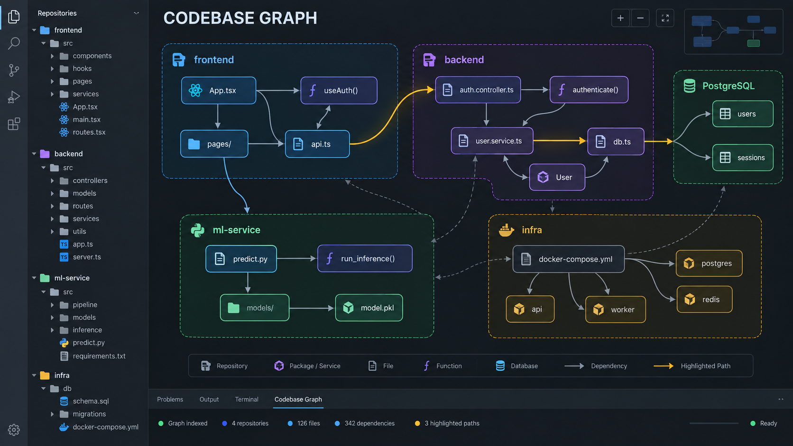

# Codebase Graph for VS Code

This extension provides VS Code agents with the `codebase-graph` MCP server. It
indexes supported source languages into one graph per actual Git repository and
one aggregate graph per opened workspace.



```text
<workspace>/<repo>/.codebase-graph/graph.json
<workspace>/.codebase-graph/workspace.json
```

All agents share those files. The extension does not create agent-specific indexes
and does not run a daemon or watcher.

## Commands

- `Codebase Graph: Index Workspace`
- `Codebase Graph: Show Index Status`
- `Codebase Graph: Open Workspace Graph`

In a multi-root VS Code window, select the workspace root to operate on. Each local
workspace root gets one workspace-scoped MCP server, which discovers its internal
repositories automatically.

The universal package contains native server binaries for x64 and ARM64 Windows,
Linux, and macOS hosts. VS Code selects the matching binary at runtime.
